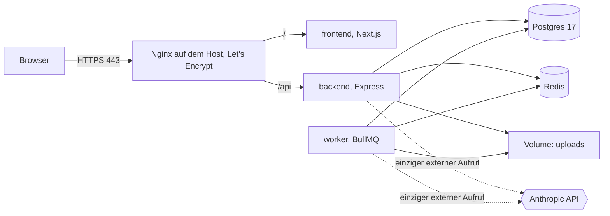
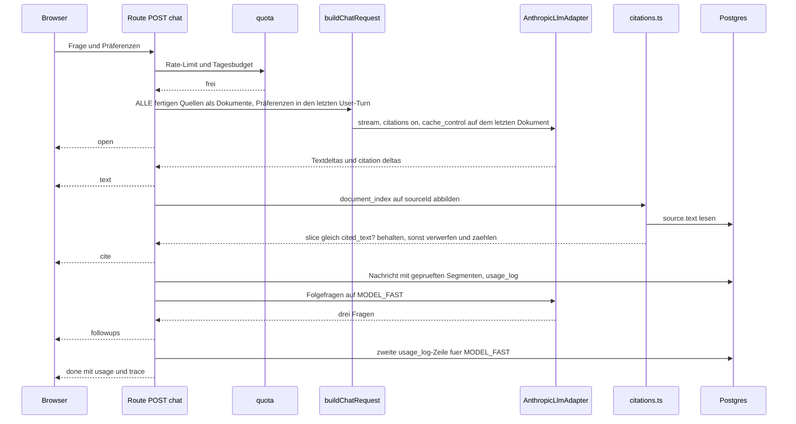
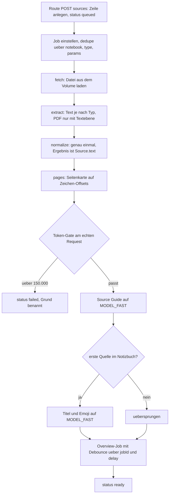

# Architektur

## Überblick

Ein Monolith in zwei Prozessen: die API beantwortet Anfragen, der Worker erledigt
alles, was länger dauert als ein Chat-Turn. Beide teilen sich Postgres, Redis und
ein Volume für hochgeladene Dateien. Der einzige Aufruf, der das Haus verlässt,
ist die Modellinferenz bei Anthropic, und die geht ausschließlich durch
`AnthropicLlmAdapter`.

Die Trennung ist keine Vorsichtsmaßnahme, sondern eine Anforderung: Ingestion und
Reports dauern Sekunden bis Minuten. Liefe das in der API, blockierte ein Upload
den Chat. Der Grundsatz dahinter steht in CLAUDE.md und gilt ohne Ausnahme: der
API-Prozess wartet nie länger auf ein Modell als einen Chat-Turn.

## Deployment



Nur Nginx hört auf einer öffentlichen Adresse. Container binden auf `127.0.0.1`,
Postgres und Redis in Produktion überhaupt nicht nach außen. Die Warteschlangen
liegen in Redis, der Zustand der Jobs zusätzlich in Postgres, damit ein Neustart
von Redis keinen Auftrag verliert, dessen Ergebnis schon geschrieben ist.

## Ein Chat-Turn

Vom Eingang der Frage bis zum aufgelösten Zitat. Der Teil, auf den es ankommt,
ist der Schritt nach dem Modell: kein Zitat wird gerendert, bevor es gegen den
gespeicherten Text geprüft wurde.



Vier Stellen sind heikel und deshalb getestet.

`document_index` ist nullbasiert über alle Dokumentblöcke hinweg und wird über die
geordnete `sourceId`-Liste des Builders aufgelöst. Die Prüfung vergleicht Zeichen,
nicht Text nach Normalisierung. Ein verworfenes Zitat wird gezählt und
protokolliert, aber weder der Zitattext noch der Ausschnitt landen im Log.

Es gehen **immer alle fertigen Quellen** als Dokumente mit. Eine Auswahl
einzelner Quellen gibt es nicht: sie würde den gecachten Prefix bei jeder
Änderung verwerfen, und der Ausweg, die Abwahl nur im letzten User-Turn
mitzuführen, verlagert die Auswahl in die Zuverlässigkeit des Modells. Die
Begründung steht in docs/KNOWN-LIMITS.md.

Der Chat-Turn schreibt zwei `usage_log`-Zeilen: eine für den Chat auf
`MODEL_CHAT`, eine für die Folgefragen auf `MODEL_FAST`.

## Ingestion als Job

Die Route legt die Quelle an und stellt den Job ein; alles danach läuft im
Worker. Jeder Schritt schreibt `step` und `heartbeatAt` auf die Zeile, damit ein
hängengebliebener Auftrag über den Index `(status, heartbeatAt)` gefunden wird.



Der Overview-Job wird verzögert eingestellt und trägt eine feste jobId je
Notizbuch. Werden drei Quellen kurz nacheinander hinzugefügt, ersetzt jede
Einstellung die vorherige und die Übersicht wird einmal berechnet statt dreimal.

## Datenmodell

Sechs Tabellen. Zwei Dinge fehlen mit Absicht. Zitate bekommen keine eigene
Tabelle: sie hängen als geprüfte `segments` an der Zeile, die sie zeigt, weil sie
ohne diese Zeile keine Bedeutung haben und nie einzeln abgefragt werden. Dieselbe
Form tragen deshalb Message, Note und Artifact, damit die Chips in einer
gespeicherten Notiz und in einem Report genauso klickbar bleiben wie im Chat.
Und es gibt keine Job-Tabelle: BullMQ hält die Warteschlange in Redis, der
dauerhafte Zustand gehört auf die Zeile, die er beschreibt, also `status`, `step`
und `heartbeatAt` auf Source und Artifact. Eine Tabelle für Rate-Buckets gibt es
ebenfalls nicht, die Limits laufen über rate-limit-redis.

Alle Schlüssel sind Strings mit UUID-Vorgabe, damit das Demo-Notizbuch die feste
id `demo` tragen kann, ohne dass der Typ dafür gebogen werden muss.

```prisma
model Notebook {
  id                     String     @id @default(uuid())
  sessionId              String?    @map("session_id")
  title                  String
  emoji                  String?
  userSetTitle           Boolean    @default(false) @map("user_set_title")
  summary                String?
  themes                 Json?
  suggestedQuestions     Json?      @map("suggested_questions")
  suggestedReportFormats Json?      @map("suggested_report_formats")
  tokenCount             Int        @default(0) @map("token_count")
  tokenModel             String?    @map("token_model")
  isDemo                 Boolean    @default(false) @map("is_demo")
  clonedFrom             String?    @map("cloned_from")
  threadResetAt          DateTime?  @map("thread_reset_at")
  overviewRequestedAt    DateTime?  @map("overview_requested_at")
  createdAt              DateTime   @default(now()) @map("created_at")
  lastUsedAt             DateTime   @default(now()) @map("last_used_at")

  sources                Source[]
  messages               Message[]
  notes                  Note[]
  artifacts              Artifact[]
  usage                  UsageLog[]

  @@index([sessionId])
  @@map("notebooks")
}

model Source {
  id           String    @id @default(uuid())
  notebookId   String    @map("notebook_id")
  position     Int
  title        String
  kind         String
  url          String?
  originalName String?   @map("original_name")
  mime         String?
  text         String
  charCount    Int       @default(0) @map("char_count")
  tokenCount   Int       @default(0) @map("token_count")
  pages        Json?
  guide        Json?
  warnings     Json?
  status       String    @default("queued")
  step         String?
  heartbeatAt  DateTime? @map("heartbeat_at")
  error        String?
  storagePath  String?   @map("storage_path")
  createdAt    DateTime  @default(now()) @map("created_at")

  notebook     Notebook  @relation(fields: [notebookId], references: [id], onDelete: Cascade)

  @@index([notebookId, position])
  @@index([status, heartbeatAt])
  @@map("sources")
}

model Message {
  id                String   @id @default(uuid())
  notebookId        String   @map("notebook_id")
  role              String
  segments          Json?
  rawContent        Json?    @map("raw_content")
  selectedSourceIds Json?    @map("selected_source_ids")
  usage             Json?
  droppedCitations  Int      @default(0) @map("dropped_citations")
  createdAt         DateTime @default(now()) @map("created_at")

  notebook          Notebook @relation(fields: [notebookId], references: [id], onDelete: Cascade)

  @@index([notebookId, createdAt])
  @@map("messages")
}

model Note {
  id            String   @id @default(uuid())
  notebookId    String   @map("notebook_id")
  title         String
  markdown      String
  segments      Json?
  fromMessageId String?  @map("from_message_id")
  createdAt     DateTime @default(now()) @map("created_at")

  notebook      Notebook @relation(fields: [notebookId], references: [id], onDelete: Cascade)

  @@index([notebookId, createdAt])
  @@map("notes")
}

model Artifact {
  id             String    @id @default(uuid())
  notebookId     String    @map("notebook_id")
  title          String?
  type           String
  params         Json?
  idempotencyKey String    @map("idempotency_key")
  status         String    @default("queued")
  heartbeatAt    DateTime? @map("heartbeat_at")
  segments       Json?
  data           Json?
  promptUsed     String?   @map("prompt_used")
  audioPath      String?   @map("audio_path")
  error          String?
  createdAt      DateTime  @default(now()) @map("created_at")
  startedAt      DateTime? @map("started_at")
  finishedAt     DateTime? @map("finished_at")

  notebook       Notebook  @relation(fields: [notebookId], references: [id], onDelete: Cascade)

  @@unique([notebookId, idempotencyKey])
  @@index([notebookId, createdAt])
  @@index([status, heartbeatAt])
  @@map("artifacts")
}

model UsageLog {
  id             String    @id @default(uuid())
  sessionId      String?   @map("session_id")
  notebookId     String?   @map("notebook_id")
  route          String
  model          String
  effort         String?
  inputTokens    Int       @default(0) @map("input_tokens")
  cacheRead      Int       @default(0) @map("cache_read")
  cacheWrite5m   Int       @default(0) @map("cache_write_5m")
  cacheWrite1h   Int       @default(0) @map("cache_write_1h")
  outputTokens   Int       @default(0) @map("output_tokens")
  costMicroCents Int       @default(0) @map("cost_micro_cents")
  requestId      String?   @map("request_id")
  latencyMs      Int       @default(0) @map("latency_ms")
  stopReason     String?   @map("stop_reason")
  createdAt      DateTime  @default(now()) @map("created_at")

  notebook       Notebook? @relation(fields: [notebookId], references: [id], onDelete: SetNull)

  @@index([sessionId])
  @@index([notebookId, createdAt])
  @@map("usage_log")
}
```

Fünf Entscheidungen in diesem Schema, die später schwer zu ändern wären:

`Source.text` ist die einzige Wahrheit über den Quelltext. Er wird beim Ingest
einmal normalisiert und danach nie angefasst; jedes Zeichen-Offset in einem Zitat
zeigt in genau diese Zeichenkette (ADR-0003).

Es gibt keine Job-Tabelle. BullMQ hält die Warteschlange in Redis; was dauerhaft
bleiben muss, steht als `status`, `step` und `heartbeatAt` auf Source und
Artifact, also auf der Zeile, die der Job beschreibt. Der Index
`(status, heartbeatAt)` auf beiden Tabellen ist genau dafür da, hängengebliebene
Arbeit zu finden (ADR-0009).

`Artifact.idempotencyKey` ist je Notizbuch eindeutig und wird aus Typ und
Parametern gebildet. Damit ist ein Auftrag idempotent, ohne dass der Worker eine
Sperre braucht. Der Schlüssel enthält keinen Doppelpunkt, weil BullMQ ihn intern
als Trenner benutzt.

`Notebook.sessionId` ist optional. Genau ein Notizbuch hat keinen Besitzer, das
Demo-Notizbuch; es ist für alle lesbar, und der erste Schreibzugriff kopiert es in
die eigene Session, wobei `clonedFrom` auf das Original zeigt (ADR-0005).

`UsageLog` trennt Cache-Schreibvorgänge nach Laufzeit, weil sie unterschiedlich
bepreist sind (ADR-0011). Kosten liegen als Mikro-Cent-Ganzzahl vor, damit keine
Gleitkommasumme über tausend Zeilen driftet. Wer sie gegen eine Obergrenze prüft,
rechnet die Grenze hoch, nicht die Summe herunter: `DAILY_SPEND_CAP_CENTS` und
`EVAL_SPEND_CAP_CENTS` werden vor dem Vergleich mit 1_000_000 multipliziert.

## Warteschlangen

Drei Queues im Worker: `ingest` (Extraktion, Normalisierung, Source Guide, Titel),
`artifact` (Overview, Reports) und `maintenance` (Aufräumjob, Cache-Wärmung). Die
vierte, `audio`, entfällt mit der Audio Overview (docs/KNOWN-LIMITS.md). Jeder Auftrag schreibt einen Heartbeat
und endet in einem terminalen Status; wiederkehrende Aufträge laufen über
`upsertJobScheduler`, der ioredis-Client benutzt `maxRetriesPerRequest: null`.

## Grenzen der Module

Backend-Module unter `backend/app/modules/`:

| Modul | Zuständig für |
|---|---|
| session | Anonyme Session, Cookie, Zuordnung von Notizbüchern |
| notebooks | Notizbücher, Home-Grid, Overview, Copy-on-first-write |
| sources | Upload, eingefügter Text, Normalisierung, Guide, Kapazitäts-Gate |
| chat | Citations API, SSE, Zitatprüfung, Folgefragen |
| studio | Reports als Jobs |
| notes | Add note, Save to note, Convert to source |
| admin | Statistiken hinter ADMIN_TOKEN |

Daneben stehen die Adapter (`ILlmProvider` mit `AnthropicLlmAdapter`,
`IFileStorage` mit `LocalFileStorage`, `ITtsProvider` als Interface), die
Services (`prompt-loader`, `usage-log`, `queue`, `quota`) und der Worker.

Ein Modul importiert nie aus einem anderen Modul. Was es von einem anderen
braucht, wird in `modules/index.ts` injiziert; das ist die einzige Datei, die
mehr als ein Modul kennt. Erzwungen wird das von `import/no-restricted-paths`,
dessen Zonen aus dem Verzeichnis erzeugt werden. Im Frontend gilt dieselbe Regel,
dort zusätzlich, dass ein Modul von außen nur über seine `index.ts` erreichbar ist.

## Streaming-Vertrag

Die Chat-Route spricht SSE. Genau acht Ereignisse, `i` ist der Index des
Segments, an das ein Ereignis gehört.

| Ereignis | Wann |
|---|---|
| `{t:'open', i}` | Der Stream steht, das Modell hat noch nichts geliefert |
| `{t:'text', i, d}` | Ein Textdelta `d` für Segment `i` |
| `{t:'cite', i, c}` | Ein geprüftes Zitat `c` für Segment `i` |
| `{t:'followups', q}` | Drei Folgefragen, nach dem Ende der Antwort |
| `{t:'truncated'}` | Die Antwort brach an der Token-Grenze ab |
| `{t:'refused', m}` | Das Modell hat die Anfrage abgelehnt |
| `{t:'done', usage, trace}` | Abschluss mit Zahlen für den Trace |
| `{t:'error', m, retry}` | Fehler mit lesbarer Meldung und Wiederholbarkeit |

`stop_reason` wird abgebildet: `end_turn` ist der Normalfall und führt zu `done`,
`max_tokens` erzeugt zusätzlich `truncated`, `refusal` erzeugt `refused`.

Alle 15 Sekunden geht ein Kommentar-Heartbeat über die Leitung, damit Proxys die
Verbindung nicht schließen. Die Antwort trägt `X-Accel-Buffering: no`, und die
Compression lässt `text/event-stream` aus; beides zusammen verhindert, dass der
Stream irgendwo gepuffert wird.

Thinking läuft adaptiv mit und erzeugt kein eigenes Ereignis. Der Chat-Request
setzt `thinking: {type: 'adaptive', display: 'summarized'}`. Das ist eine
Produktentscheidung, keine Feinheit: auf Opus 5 ist `display: 'omitted'` der
Standard, die Blöcke kommen dann mit leerem Text, und der Nutzer sitzt bis zum
ersten Token vor einer stummen Pause. Genau das verbietet der Abschnitt
Kern-Interaktionen in docs/SPEC.md, und in einer Aufnahme fällt die gefühlte
Latenz als Erstes auf. Thinking wird unter jedem `display` gleich abgerechnet,
die Zusammenfassung kostet also nichts.

Die Zusammenfassung wird nie als Antworttext gerendert. Sie füllt den Denkzustand
über dem Stream, bis das erste `text`-Ereignis kommt, und verschwindet dann. Die
Blöcke selbst liegen mit ihrer Signatur in `rawContent`, damit der nächste Turn
sie unverändert wiedereinspielen kann, und ihre Token stehen im Trace.

## Regeln für den Request-Aufbau

Die vollständigen Regeln stehen in `prompts/README.md` und werden hier nicht
wiederholt. Vier davon bestimmen die Architektur:

Der System-Block ist eingefroren und trägt kein `cache_control`. Alle fertigen
Quellen gehen als `text/plain`-Dokumentblöcke in Positionsreihenfolge mit, auch
abgewählte. Genau ein Breakpoint mit einer Stunde sitzt auf dem letzten Dokument.
Alles, was sich je Turn ändert, steht im letzten User-Turn: die Frage und die
Präferenzen aus Configure chat.
