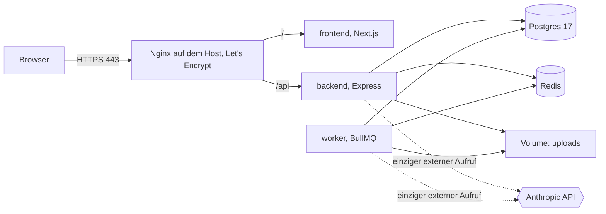
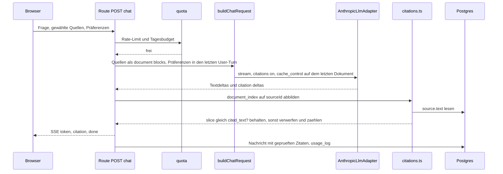

# Architektur

## Überblick

Ein Monolith in zwei Prozessen: die API beantwortet Anfragen, der Worker erledigt
alles, was länger dauert als ein Chat-Turn. Beide teilen sich Postgres, Redis und
ein Volume für hochgeladene Dateien. Der einzige Aufruf, der das Haus verlässt,
ist die Modellinferenz bei Anthropic, und die geht ausschließlich durch
`AnthropicLlmAdapter`.

Die Trennung ist keine Vorsichtsmaßnahme, sondern eine Anforderung: Ingestion und
Reports dauern Sekunden bis Minuten. Liefe das in der API, blockierte ein Upload
den Chat. Der Grundsatz dahinter steht in CLAUDE.md und gilt ohne Ausnahme: der
API-Prozess wartet nie länger auf ein Modell als einen Chat-Turn.

## Deployment



Nur Nginx hört auf einer öffentlichen Adresse. Container binden auf `127.0.0.1`,
Postgres und Redis in Produktion überhaupt nicht nach außen. Die Warteschlangen
liegen in Redis, der Zustand der Jobs zusätzlich in Postgres, damit ein Neustart
von Redis keinen Auftrag verliert, dessen Ergebnis schon geschrieben ist.

## Ein Chat-Turn

Vom Eingang der Frage bis zum aufgelösten Zitat. Der Teil, auf den es ankommt,
ist der Schritt nach dem Modell: kein Zitat wird gerendert, bevor es gegen den
gespeicherten Text geprüft wurde.



Drei Stellen sind heikel und deshalb getestet: `document_index` ist nullbasiert
über alle Dokumentblöcke hinweg und wird über die geordnete `sourceId`-Liste des
Builders aufgelöst; die Prüfung vergleicht Zeichen, nicht Text nach
Normalisierung; ein verworfenes Zitat wird gezählt und protokolliert, aber weder
der Zitattext noch der Ausschnitt landen im Log.

## Datenmodell

Sieben Tabellen. Zitate bekommen keine eigene: sie hängen als geprüftes JSON an
der Nachricht, weil sie ohne ihre Nachricht keine Bedeutung haben und nie einzeln
abgefragt werden. Alle Schlüssel sind Strings mit UUID-Vorgabe, damit das
Demo-Notizbuch die feste id `demo` tragen kann, ohne dass der Typ dafür gebogen
werden muss.

```prisma
model Notebook {
  id         String     @id @default(uuid())
  sessionId  String?    @map("session_id")
  title      String
  emoji      String?
  summary    String?
  themes     Json?
  questions  Json?
  isDemo     Boolean    @default(false) @map("is_demo")
  lastUsedAt DateTime   @default(now()) @map("last_used_at")
  createdAt  DateTime   @default(now()) @map("created_at")
  updatedAt  DateTime   @updatedAt @map("updated_at")

  sources    Source[]
  messages   Message[]
  notes      Note[]
  artifacts  Artifact[]
  jobs       Job[]
  usage      UsageLog[]

  @@index([sessionId, lastUsedAt])
  @@map("notebooks")
}

model Source {
  id            String    @id @default(uuid())
  notebookId    String    @map("notebook_id")
  position      Int
  kind          String
  title         String
  fileName      String?   @map("file_name")
  storageKey    String?   @map("storage_key")
  sourceUrl     String?   @map("source_url")
  text          String
  charCount     Int       @map("char_count")
  tokenCount    Int       @default(0) @map("token_count")
  pageMap       Json?     @map("page_map")
  guide         Json?
  warnings      String[]
  status        String    @default("queued")
  statusStep    String?   @map("status_step")
  failureReason String?   @map("failure_reason")
  createdAt     DateTime  @default(now()) @map("created_at")

  notebook      Notebook  @relation(fields: [notebookId], references: [id], onDelete: Cascade)

  @@unique([notebookId, position])
  @@index([notebookId, status])
  @@map("sources")
}

model Message {
  id               String   @id @default(uuid())
  notebookId       String   @map("notebook_id")
  threadId         String   @map("thread_id")
  role             String
  text             String
  blocks           Json?
  citations        Json?
  droppedCitations Int      @default(0) @map("dropped_citations")
  followUps        Json?    @map("follow_ups")
  createdAt        DateTime @default(now()) @map("created_at")

  notebook         Notebook @relation(fields: [notebookId], references: [id], onDelete: Cascade)

  @@index([notebookId, threadId, createdAt])
  @@map("messages")
}

model Note {
  id         String   @id @default(uuid())
  notebookId String   @map("notebook_id")
  title      String
  text       String
  origin     String   @default("manual")
  createdAt  DateTime @default(now()) @map("created_at")

  notebook   Notebook @relation(fields: [notebookId], references: [id], onDelete: Cascade)

  @@index([notebookId, createdAt])
  @@map("notes")
}

model Artifact {
  id             String   @id @default(uuid())
  notebookId     String   @map("notebook_id")
  kind           String
  status         String   @default("queued")
  title          String?
  body           String?
  data           Json?
  citations      Json?
  promptName     String?  @map("prompt_name")
  promptRendered String?  @map("prompt_rendered")
  failureReason  String?  @map("failure_reason")
  createdAt      DateTime @default(now()) @map("created_at")

  notebook       Notebook @relation(fields: [notebookId], references: [id], onDelete: Cascade)

  @@index([notebookId, kind, createdAt])
  @@map("artifacts")
}

model Job {
  id            String    @id @default(uuid())
  notebookId    String?   @map("notebook_id")
  queue         String
  type          String
  dedupeKey     String    @unique @map("dedupe_key")
  status        String    @default("queued")
  step          String?
  attempts      Int       @default(0)
  heartbeatAt   DateTime? @map("heartbeat_at")
  failureReason String?   @map("failure_reason")
  createdAt     DateTime  @default(now()) @map("created_at")
  updatedAt     DateTime  @updatedAt @map("updated_at")

  notebook      Notebook? @relation(fields: [notebookId], references: [id], onDelete: Cascade)

  @@index([queue, status])
  @@map("jobs")
}

model UsageLog {
  id              String    @id @default(uuid())
  notebookId      String?   @map("notebook_id")
  route           String
  model           String
  effort          String?
  inputTokens     Int       @default(0) @map("input_tokens")
  outputTokens    Int       @default(0) @map("output_tokens")
  cacheReadTokens Int       @default(0) @map("cache_read_tokens")
  cacheWrite5m    Int       @default(0) @map("cache_write_5m_tokens")
  cacheWrite1h    Int       @default(0) @map("cache_write_1h_tokens")
  costMicroCents  Int       @default(0) @map("cost_micro_cents")
  latencyMs       Int       @default(0) @map("latency_ms")
  createdAt       DateTime  @default(now()) @map("created_at")

  notebook        Notebook? @relation(fields: [notebookId], references: [id], onDelete: SetNull)

  @@index([createdAt])
  @@map("usage_log")
}
```

Vier Entscheidungen in diesem Schema, die später schwer zu ändern wären:

`Source.text` ist die einzige Wahrheit über den Quelltext. Er wird beim Ingest
einmal normalisiert und danach nie angefasst; jedes Zeichen-Offset in einem Zitat
zeigt in genau diese Zeichenkette (ADR-0003).

`Job.dedupeKey` ist eindeutig und wird aus Notizbuch, Typ und Parametern gebildet.
Damit ist ein Auftrag idempotent, ohne dass der Worker eine Sperre braucht. Der
Schlüssel enthält keinen Doppelpunkt, weil BullMQ ihn intern als Trenner benutzt.

`Notebook.sessionId` ist optional. Genau ein Notizbuch hat keinen Besitzer, das
Demo-Notizbuch; es ist für alle lesbar, und der erste Schreibzugriff kopiert es in
die eigene Session (ADR-0005).

`UsageLog` trennt Cache-Schreibvorgänge nach Laufzeit, weil sie unterschiedlich
bepreist sind. Kosten liegen als Mikro-Cent-Ganzzahl vor, damit keine
Gleitkommasumme über tausend Zeilen driftet.

## Warteschlangen

Vier Queues im Worker: `ingest` (Extraktion, Normalisierung, Source Guide, Titel),
`artifact` (Overview, Reports, später Mind Map), `audio` (Skript und TTS),
`maintenance` (Aufräumjob, Cache-Wärmung). Jeder Auftrag schreibt einen Heartbeat
und endet in einem terminalen Status; wiederkehrende Aufträge laufen über
`upsertJobScheduler`, der ioredis-Client benutzt `maxRetriesPerRequest: null`.

## Grenzen der Module

Ein Modul unter `backend/app/modules/` importiert nie aus einem anderen Modul.
Was ein Modul von einem anderen braucht, wird in `modules/index.ts` injiziert.
Erzwungen wird das von `import/no-restricted-paths`, dessen Zonen aus dem
Verzeichnis erzeugt werden; im Frontend gilt dieselbe Regel, dort zusätzlich, dass
ein Modul von außen nur über seine `index.ts` erreichbar ist.
